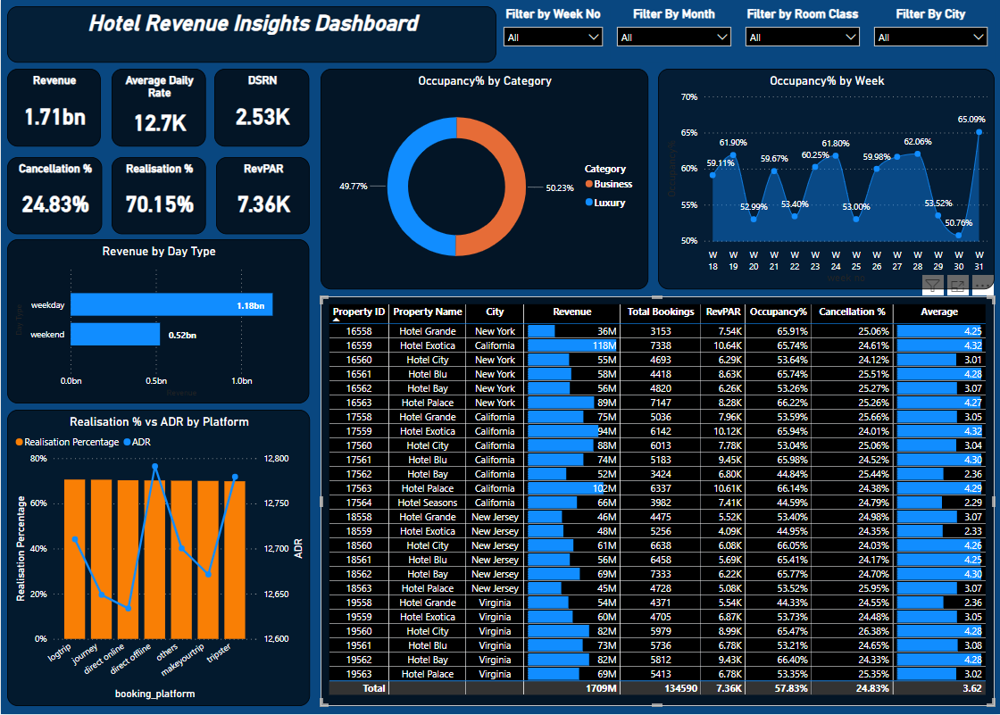

# Hotel-Revenue-Insights

## Introduction

In the ever-evolving hospitality industry, data-driven decision-making is paramount to the success of hotels and resorts. Hotel revenue insights data provide valuable information and analytics to hotel management, enabling them to optimize revenue generation, enhance guest experiences, and improve operational efficiency. These insights are derived from a comprehensive analysis of various revenue streams, occupancy trends, and guest behaviors.

Hotel revenue insights data encompass a wide range of financial and operational metrics that shed light on the overall financial health and performance of a hotel. Key performance indicators (KPIs) such as room revenue, average daily rate (ADR), occupancy rate, and revenue per available room (RevPAR) form the foundation of these insights, offering a comprehensive view of the hotel's revenue-generating capabilities.

Additionally, hotel revenue insights data provide invaluable segmentation details, which reveal revenue distribution across different guest segments, including business travelers, leisure guests, group bookings, and more. This segmentation data aids in tailoring marketing strategies and service offerings to meet the specific needs of each guest category.

Moreover, hotel revenue insights data capture seasonal patterns and trends, enabling hotels to proactively plan for fluctuations in demand and adjust pricing strategies accordingly. Understanding peak seasons, low-demand periods, and booking patterns helps optimize room rates and revenue during various times of the year.

In this era of data-driven decision-making, hotel revenue insights data play a pivotal role in providing actionable intelligence to hoteliers. Armed with these valuable insights, hotel management can make informed choices, optimize revenue streams, and maintain a competitive edge in the dynamic and competitive hospitality market.

## Problem Statement

1. How much total Revenue is generated by the hotel industry?
2. What is the average daily rate of the rooms?
3. How much Revenue is generated per available room?
4. What is the Realisation % and Cancellation % in the hotel industry?
5. How much revenue is generated on weekdays and weekends?
6. Realisation % vs Average Daily Rate on different website platforms?
7. What is Occupancy % by Category and by Weeks?
8. Generate a table with all important metrics for all the hotels?

## Dashboard

